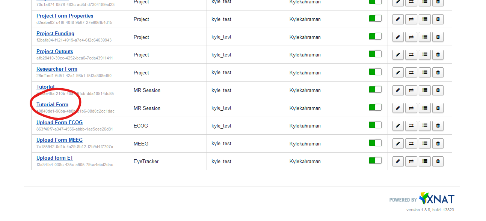
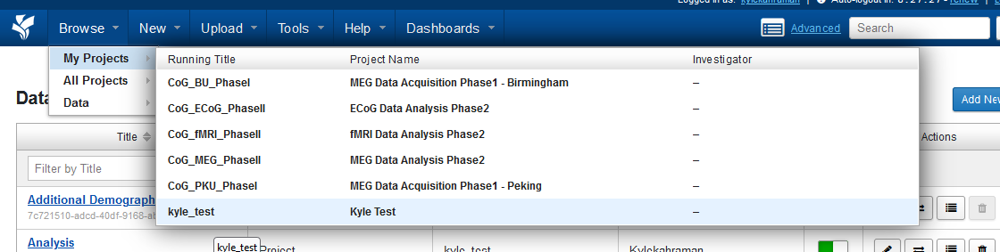
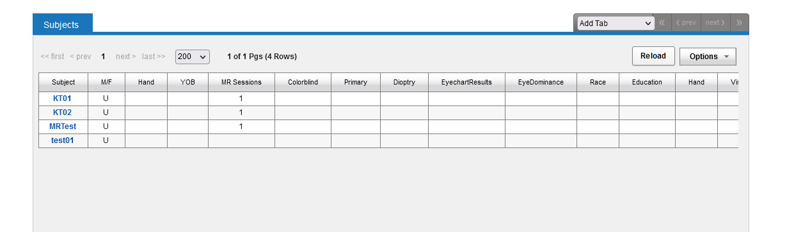

# xnat-custom-form-templates

*Disclaimer: The templates provided here are to help you enable deploying your own custom forms quickly and easily. They are also subject to change. Please pick and choose appropriately. Check to ensure for correctness before deployment. If you think you have templates that may be useful for others please make a PR.*

JSON Templates for easily creating custom forms on [XNAT](https://xnat.org).

XNAT provides the  [Custom Forms](https://wiki.xnat.org/documentation/how-to-use-xnat/using-custom-forms)  feature that enables users to define and store relevant metadata. Here we include some templates to enable users to get started quickly with creating and using custom forms.

## Usage

After logging into XNAT, go to **Tools > Custom Forms > Manage Custom Forms**


Now you should land on this page, where every custom form that has been created in your project is shown. 


When you click on the **"Add New"** button, multiple dialogue windows show up, where you select the specifics of your custom form.

This is the first one:


Here you first type in the title you want to give to the form. Best practice would be to choose something that you can easily recognize later, which is descriptive enough for people outside the project to understand. 
The form order can be left at 10. 
For **"Base XNAT Datatype"** you have multiple options, depending on how your project is organized. In general XNATs hierarchy is like this (from low to high): **Session > Subject > Project.**

If you want to create a custom form for a specific modality, then that would be at the Session level. For this tutorial we are going with a Form for a MR Session.

When you press next, this window opens:


It's important here to choose **"NO"**, if the form you are creating is for your specific project in the XNAT instance. When choosing "No", you have to specify the project you want to create this form for. 

This is the last dialogue window you will see before your form is created:


On the left you have multiple small menus that contain components you can drag and drop to the right field. 


Because we assume that you will create the form through a JSON file, we will only drag and drop a textfield component to the right box. This window opens then:
You can also directly create change this


Here you can leave everything as is, and click on save in the right corner.


Congratulations, now your form is saved, but it's not populated yet with the fields you'd like to. So the next step is to click on the form you just created:


Now the same window opens as when you dragged in the textfield component. The difference now is that in the bottom right corner there is also the field **"Edit JSON"** visible.


When you click on the "Edit JSON" button, this window shows up:


Here you can copy the details from your form under "components":

```json
"components":[ 
    {
        YOUR FORM HERE
    }
]
```

Example with form pasted in:

```json
"components":[ 
    {
        "key": "task_name",
        "type": "textfield",
        "input": true,
        "label": "Task Name",
        "tableView": true
    }
]
```

Now you can save the form and re-open it to see if everything worked.



Next: Populating Values manually

Now that we've created a custom form, we want to populate it with values. Even though it would be possible to do this with a script, we will do it manually. For this you need to click on a project in your XNAT instance.



Next you select the subject where you want to fill in the custom form.



Now you will land on the subject page where you can see data that is attached to the subject. On the right side there is an action menu. On this action menu we click on **"Edit"** to change or add values.


On this last page you see unter **"Custom Field Sets"** all custom forms that have been created on the subject level. Here we only have one for additional demographics. Now you can fill in information how you like and when you're done scroll down and press **"Submit"**.


Congratulations, now you're able to create custom forms and fill in information in them.

## Video demonstrating how to use the templates


https://github.com/Cogitate-consortium/xnat-custom-form-templates/assets/4293133/feee18d0-7b29-4506-97a9-224bff17ef5d


## Gotchas

1. Before saving the forms check to ensure that the JSON is valid.
2. If there are multiple UUIDs in the json definition of a form, then there is something wrong. The content and structure of the forms as saved on XNAT can be seen within the XML file. This can be used to verify if fields and values were correctly saved.
3. It is possible to populate custom forms via REST API, but this is still quite experimental and may lead to unexpected results.

## Acknowledgements

This project was made possible through the support of a grant from the Templeton World Charity Foundation, Inc. The tool has been developed as a part of the [ARC-COGITATE](https://www.arc-cogitate.com/) project.
