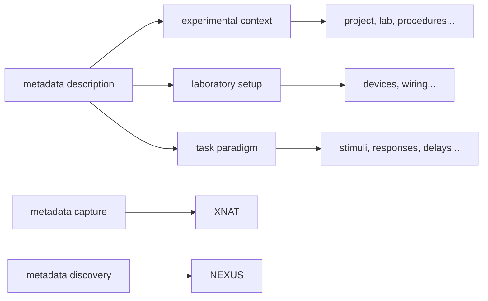
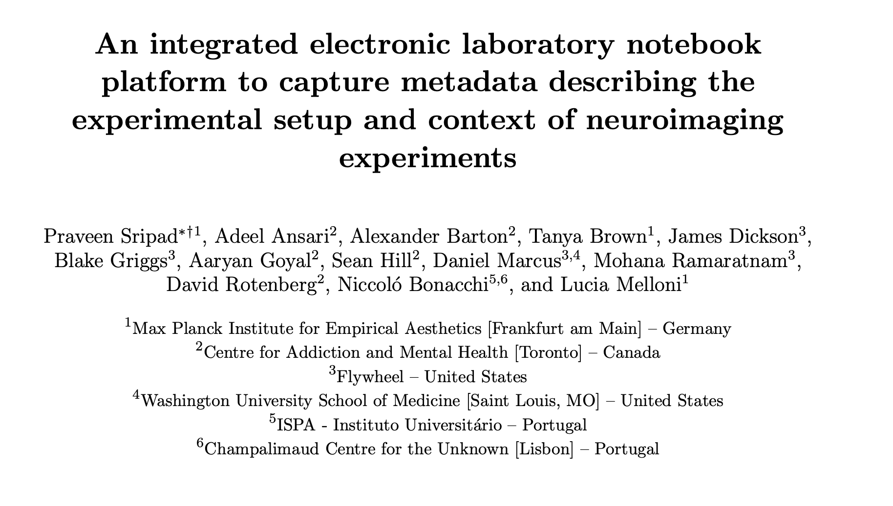

This document provides the background information on the TWCF Electronic Lab Notebook (ELN) project of which this tool is an output. 

## ELN Project
The ELN project has been funded by the below grants by the Templeton World Charity Foundation, Inc. and have been conducted as part of the [ARC-COGITATE project](https://www.arc-cogitate.com/). 

- TWCF0486: A Collaborative Electronic Laboratory Notebook for Open, Shared and Reproducible Data-Driven Science
- TWCF0485: A user-friendly electronic lab notebook to accelerate brain research

## Abstract
The emerging popularity of open science has lead to more and more data being publicly shared across the community. Openly shared data require rich metadata in order to ensure usability and reproducibility. Further, with larger numbers of smaller datasets being shared it becomes critical to be able to combine these datasets in order to use them successfully. This requires a structured way to describe experimental setup and context. 

Our goal is to provide an open electronic laboratory notebook platform that enables the description, capture, and search of metadata related to a neuroimaging experiment. The platform consists of three components: metadata description, metadata capture and metadata discovery. The description component consists of a structured metadata specification based on controlled terminology that describes the experimental context (e.g. project, lab), the laboratory setup (devices used), and the paradigm (stimuli used, responses etc.). The capture component is a user friendly way for users to provide metadata into the platform. This is integrated into the XNAT data management tool. Lastly, the data search component will enable semantically enabled queries across the metadata via the NEXUS platform. 

With this platform we hope to provide the community with a toolset that will enable researchers to describe their experiments in a machine readable manner, share datasets with rich semantically enabled metadata and perform in-depth searches across shared datasets.

Three components of the ELN,

Various tools and scripts have been built to enable the ELN. This includes custom forms built into XNAT, scripts to extract and transform metadata from XNAT into NEXUS and finally Jupyter notebooks that demonstrate querying NEXUS and performing analysis with the resulting data. 

## ELN Team

